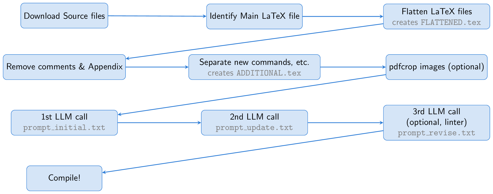

# paper2slides

Transform any arXiv papers into slides using Large Language Models (LLMs)! This tool is useful for quickly grasping the main ideas of research papers.

Some examples of generated slides are: [word2vec](demo/1301.3781.pdf)
[GAN](demo/1406.2661.pdf), [Transformer](demo/1706.03762.pdf), [ViT](demo/2010.11929.pdf), [Chain-of-Thought](demo/2201.11903.pdf), [STaR](demo/2203.14465.pdf), [DPO](demo/2305.18290.pdf), and [The AI Scientist](demo/2408.06292.pdf).
See many other examples of generated slides in [Demo](demo/).

*The script will download files from the internet (arXiv), send information to the OpenAI API, and compile locally. Please be cautious about the content being shared and the potential risks. If you have a specific Arxiv ID that you are interested in and do not want to run the code yourself, let me know in "Discussions" and I would be happy to add the slides to the demo list.*

## How does it work?

<div style="text-align: center;">
    
</div>

The process begins by downloading the source files of an arXiv paper. The main LaTeX file is identified and flattened, merging all input files into a single document (`FLATTENED.tex`). We preprocess this merged file by removing comments and the appendix. This preprocessed file, along with instructions for creating good slides, forms the basis of our prompt.

One key idea is to use Beamer for slide creation, allowing us to stay entirely within the LaTeX ecosystem. This approach essentially turns the task into a summarization exercise: converting a long LaTeX paper into concise Beamer LaTeX. The LLM can infer the content of figures from their captions and include them in the slides, eliminating the need for vision capabilities.

To aid the LLM, we create a file called `ADDITIONAL.tex`, which contains all necessary packages, \newcommand definitions, and other LaTeX settings used in the paper. Including this file with `\input{ADDITIONAL.tex}` in the prompt shortens it and makes generating slides more reliable, particularly for theoretical papers with many custom commands.

The LLM generates Beamer code from the LaTeX source, but since the first run may have issues, we ask the LLM to self-inspect and refine the output. Optionally, a third step involves using a linter to check the generated code, with the results fed back to the LLM for further corrections (this linter step was inspired by [The AI Scientist](https://www.arxiv.org/abs/2408.06292)). Finally, the Beamer code is compiled into a PDF presentation using pdflatex.

The `all.zsh` script automates the entire process, typically completing in less than a few minutes with GPT-4o for a single paper.

## Installation

Requirements are:
- Python 3.10 or higher
- `requests` library
- `arxiv` library
- `openai` library
- `arxiv-latex-cleaner` library
- OpenAI API key
- A working installation of `pdflatex`
- Optional: chktex (for linter) and pdfcrop

Steps for installation:

1. Clone this repository:
    ```sh
    git clone https://github.com/takashiishida/paper2slides.git
    cd paper2slides
    ```

2. Install the required Python packages:
    ```sh
    pip install requests arxiv openai arxiv-latex-cleaner
    ```

3. Ensure `pdflatex` is installed and available in your system's PATH. Optionally check if you can compile the sample `test.tex` by `pdflatex test.tex`. Check if `test.pdf` is genereated correctly. Optionally check `chktex` and `pdfcrop` are working.

4. Set up your OpenAI API key:
    ```sh
    export OPENAI_API_KEY='your-api-key'
    ```

## Usage

### Using `all.sh` Script

This script automates the process of downloading an arXiv paper, processing it, and converting it to a Beamer presentation.

```sh
bash all.sh <arxiv_id>
```

Replace `<arxiv_id>` with the desired arXiv paper ID.
The ID can be identified from the URL: the ID for `https://arxiv.org/abs/xxxx.xxxx` is `xxxx.xxxx`.

### Individual Scripts

You can also run the Python scripts individually for more control.

1. **Download and Process arXiv Source Files**

    ```sh
    python arxiv2tex.py <arxiv_id>
    ```

    This script downloads the source files of the specified arXiv paper, extracts them, and processes the main LaTeX file. Results will be saved in `source/<arxiv_id>/FLATTENED.tex` and `source/<arxiv_id>/ADDITIONAL.tex`.

2. **Convert LaTeX to Beamer**

    ```sh
    python tex2beamer.py --arxiv_id <arxiv_id>
    ```

    This script reads the processed LaTeX files and prepares Beamer slides. This is where we are using the OpenAI API. We call twice, first to generate the beamer code, and then to self-inspect the beamer code.
    Optionally use the following flags: `--use_linter` and `--use_pdfcrop`.
    The prompts sent to the LLM and the response from the LLM will be saved in `tex2beamer.log`.
    The linter log will be saved in `source/<arxiv_id>/linter.log`.

3. **Convert Beamer to PDF**
    ```sh
    python beamer2pdf.py <arxiv_id>
    ```
    
    This script compiles the beamer file into a PDF presentation.

### Prompts
The prompts are saved in `prompt_initial.txt`, `prompt_update.txt`, and `prompt_revise.txt` but feel free to adjust them to your needs. They contains a placeholder called `PLACEHOLDER_FOR_FIGURE_PATHS`. This will be replaced with the figure paths used in the paper. We want to make sure the paths are correctly used in the beamer code. The LLM often make mistakes, so we explicitly include this in the prompt.

## Notes
The success rate is around 90 percent in my experience (compile may fail or image path may be wrong in some cases). If you have encounter any issues or have any suggestions for improvements, please feel free to let me know!
